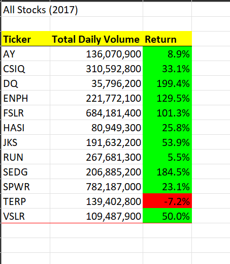
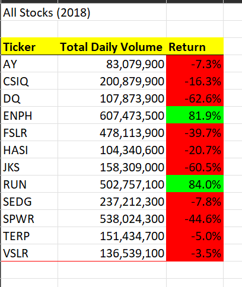
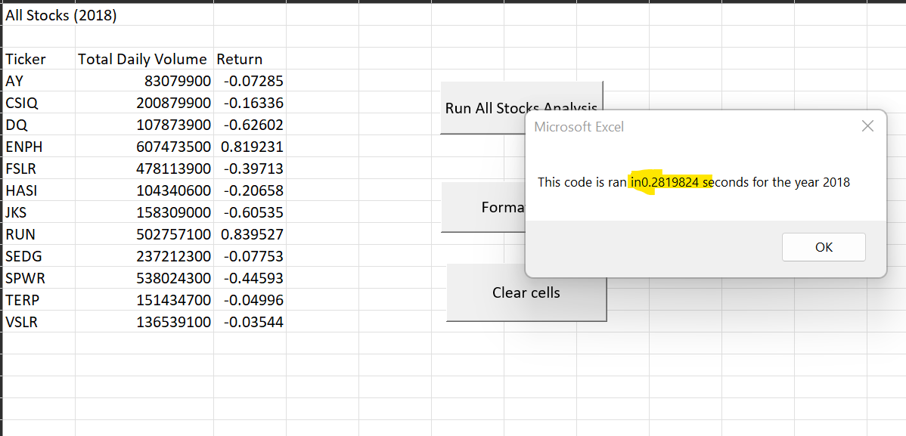
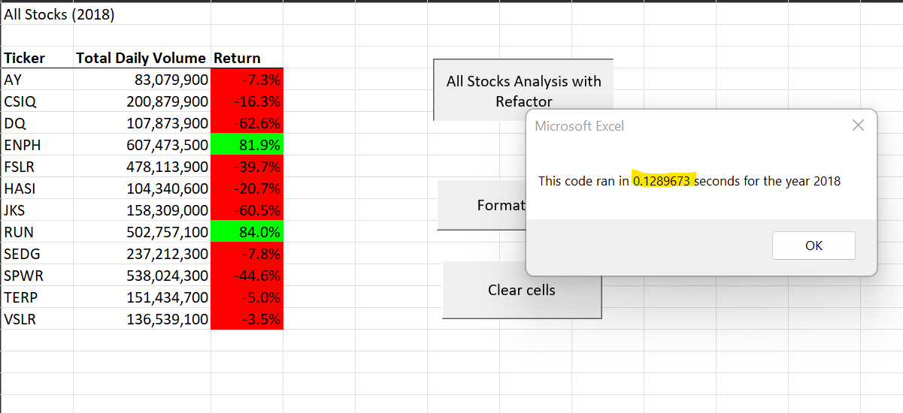

# stock-analysis

## Overview of Project:
Steve want to analyze his father’s current financial portfolio and also would like to explore more option to diversify investment in higher gaining companies.

## Results:

1. Stock performance for 2017 year.

2. Stock performance for 2018 year.

3. Code execution time - before refactored for 2018 year

4. Code execution time - after refactored for 2018 year

5. Execution time before refactored is 0.2819 seconds and execution time after refactored is 0.1289 second. this show total time reduction is 50% with compare to without refactored.

## Summary:
1. Steve's father current investment in DQ stock is in negative trend.
2. Steve's father has an opportunity to derversified his investmenet in other companies like "ENPH" and "RUN" stock to get potintially high growth.
3. it is observed that code execution time is much improved (i.e. less time to execute code) more than 50% reduction in execution time. however refoctoring code is complex to implement.
4. I have observed that it's take some time to findout the way to refactor normal VBA codes. but once refoctoring is completed its reduced code execution time and become more structured coding. 